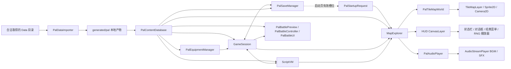
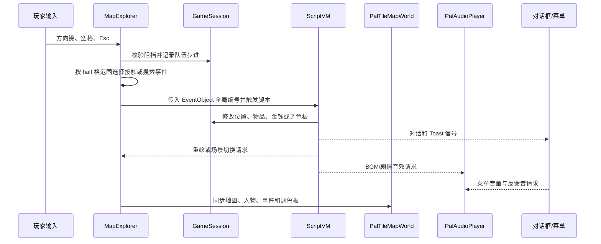

# 整体架构与数据流

项目将“原版静态内容”和“本次游戏的可变状态”严格分开。原版数据先离线转换，本次运行只通过内容数据库读取；脚本虚拟机修改 `GameSession` 和当前事件对象，渲染层只把这些状态显示出来。

## 状态所有权

| 模块 | 持有什么 | 不负责什么 |
| --- | --- | --- |
| `PalDataImporter` | 一次导入的校验结果和生成路径 | 游戏运行、存档、剧情状态 |
| `PalContentDatabase` | 场景、脚本、事件、物品、毒、角色定义和资源缓存 | 玩家当前金钱、位置、背包 |
| `GameSession` | 当前场景、队伍、位置、轨迹、背包、金钱、角色等级/HP/MP/仙术、毒与九种状态、六槽装备及其效果、调色板 | 解码原版文件、绘制 UI |
| `PalSaveManager` | 100 个 Godot 存档槽、格式版本、内容指纹、校验和与剧情运行时快照 | 兼容原版 `.rpg`、保存半句对话或战斗中间帧 |
| `PalStartupRequest` | 下一次进入探索场景要读取的一次性槽位编号 | 读取存档文件、持有完整会话、绕过存档校验 |
| `PalEquipmentManager` | 当前一次装备脚本的部位上下文和诊断 | 持久保存装备、直接绘制装备页 |
| `ScriptVM` | 当前指令入口、等待原因、自动脚本调度 | 持久化内容、直接绘制画面 |
| `MapExplorer` | 输入与各模块的编排、当前场景事件引用 | 重新解释资源格式 |
| `PalMapCoordinates` | 世界像素到菱形 MAP half 的碰撞换算、玩家活动边界 | 读取地图内容、修改队伍位置 |
| `PalTileMapWorld` | 地图节点、相机、人物节点、调色板材质和遮挡 | 决定事件是否触发、修改剧情 |
| `PalAudioPlayer` | 当前 BGM、音效声道、循环淡入淡出和即时音量 | 决定场景曲目编号、保存剧情进度 |
| `PalBattleController` | 单场敌人体力、敌人毒/状态、合击贡献者、保护判定、指令、身法队列、回合末毒结算和胜负 | 读取原始文件、绘制 Sprite |
| `PalBattlePreview` | 当前敌队、战场、双方节点、目标选择和攻击动画 | 自行计算伤害、修改探索剧情 |
| `PalBattleUI` | 原版状态框、四向指令、仙术列表和上浮数字 | 提交指令、扣除 HP/MP |
| `PalRngPlayer` | 当前过场帧区间、播放速度和可见状态 | 修改角色数值、决定后续脚本入口 |
| UI | 对话、Toast、菜单和资源实验室的显示状态，以及场外仙术的施法者/目标选择 | 绕过 ScriptVM 修改剧情、直接扣除仙术 MP |

## 启动与场景加载

1. Godot 从 `scenes/main.tscn` 启动资源实验室。
2. 用户选择本机数据目录后，`PalDataImporter` 只读原始文件并写入被忽略的 `generated/pal/`。
3. 已有生成内容时，启动页提供“开始新游戏”和“读取存档”；读档页复用 `PalGameMenu` 的 100 槽原版 UI，只把确认的槽位写入一次性 `PalStartupRequest`。
4. 进入探索场景时，`PalContentDatabase.load_generated()` 读取结构化内容，`GameSession.reset_new_game()` 先建立安全默认状态。
5. 若存在启动读档请求，`MapExplorer` 让 `PalSaveManager` 重新验证并恢复该槽；否则按新游戏状态运行场景进入脚本。请求在读取后立即清空。
6. `MapExplorer` 根据 `scene_index` 取得 `map_number` 与场景事件；读档不重跑 `script_on_enter`，新游戏才执行进入脚本。
7. `PalTileMapWorld` 实例化该 `map_number` 对应的 TileMap 场景；多个剧情场景可以复用同一地图资源。
8. `ScriptVM` 通过信号请求重绘、对话、人物动作或场景切换。

系统菜单保存时，`PalSaveManager` 从 `GameSession` 和运行时内容数据库复制队伍、背包、装备、Scene、EventObject 与脚本游标，再写入 `user://saves/`。读档先验证格式、内容指纹和 SHA-256，随后恢复会话与可变剧情数据，由装备管理器重建派生属性、地图层重载场景但不重跑进入脚本。完整边界见[Godot 版本化存档系统](SAVE_SYSTEM.md)。

`PalTileMapWorld.load_map()` 在场景载入时实例化生成的 PackedScene；`sync_world()` 在位置、事件帧或调色板变化时更新相机和动态 Sprite。`MapExplorer` 默认走该路径，命令行用户参数 `--pal-map-backend=legacy` 可临时启用 CPU 基准。

`Camera2D` 只负责移动地图、人物与事件所在的世界画布。顶部状态栏、对话框、Toast、经典菜单和 RNG 过场播放器统一挂在前景 `HudLayer: CanvasLayer`，因此不会随队伍相机平移，也不会被地图节点遮挡。屏幕渐变层位于 RNG 之上；RNG 首帧负责消费前置 `0050` 的待渐显状态，播放器在遮罩变透明前暂停帧计时，避免整段电影被黑层覆盖或漏掉开头。RNG 播放期间 `ScriptVM.waiting_for_rng` 阻止地图输入和后续指令，播放完成后再恢复。

经典菜单的状态页只读取 `GameSession` 与内容数据库；场外仙术页选择施法者、仙术和我方目标后，把类型化请求交给 `MapExplorer`。探索控制器关闭菜单，依次执行对象的 `script_on_use`、`script_on_success`，两段成功后才从施法者 MP 扣除 DATA 定义的消耗；脚本等待期间地图输入保持关闭，结束后回到刷新过可用状态的仙术列表。

每个 10 FPS 脚本帧中，`ScriptVM` 还会遍历当前场景的 EventObject：先更新临时消失/重现生命周期，再执行一条自动脚本。追逐事件通过 `set_scene_map()` 读取当前 PAL 地图阻挡；自动移动进入玩家接触范围后，`MapExplorer` 在同一更新周期运行触发脚本。

手动搜索由 `MapExplorer` 按 SDLPal `PAL_GetSearchTriggerRange` 生成面向方向上的 13 个 half 格检查点，再按“检查点顺序 → EventObject 全局顺序”选择目标。搜索模式只决定允许扫描多少个检查点；它不使用普通欧氏或曼哈顿最近距离。命中普通 NPC 后，`MapExplorer` 先让 NPC 转向队伍、恢复双方站立状态并重绘，再把全局对象编号交给 `ScriptVM`。

接触事件按 `abs(dx) + abs(dy) × 2` 的 PAL 加权距离和触发模式阈值扫描。SDLPal 的触发脚本是同步函数，因此一个更新周期可以继续检查后续对象；Godot VM 可能等待对话、帧数或自动行走，`MapExplorer` 会保存下一 EventObject 索引，在 `script_finished` 后续跑。若脚本请求切换场景，旧场景扫描立即丢弃，避免转场前误触后续对象。

EventObject 自动脚本完成一帧动作后，`MapExplorer` 还会检查有 Sprite 的阻挡对象是否与队伍脚点重叠。若重叠，按 NPC 朝向旋转寻找可走 half 格并只平移视口；`GameSession.displace_party_from_blocker()` 保留原队伍轨迹和朝向，使这次脱困不被误认为玩家主动走了一步。

场景进入与传送离开是两条不同生命周期：`0059` 只请求加载目标场景并运行其 `script_on_enter`；`0038` 先把当前场景的 `script_on_teleport` 当作可等待的嵌套触发脚本执行，完成后再回到调用脚本。两种脚本都可以通过 `0059` 交给 `MapExplorer` 延迟到安全时机切换地图。

## 输入、事件与重绘

移动和脚本仍使用 PAL 世界像素坐标。TileMapLayer 只是这些数据的 Godot 原生显示投影，不替代 `.map`、场景定义或 ScriptVM 行为基准。

需要判断地图阻挡时，`MapExplorer`、`PalTileMapWorld` 和 `ScriptVM` 不各自推测 half，而是统一调用 `PalMapCoordinates.world_to_tile()`。这样主动移动、TileSet 的 `pal_blocked` 和 NPC 追逐在菱形边缘读取同一条 MAP 记录；坐标越界仍一律视为阻挡。

事件对象碰撞也统一使用 `PalMapCoordinates.positions_collide()` 的严格加权距离 `<16`。`vanish_time` 只控制临时显示和事件更新；只要对象 `state >= 2`，移动阻挡仍按 SDLPal 保留。NPC 与队伍真正重叠后的脱困另用 `≤12`，两种阈值不能混用。

## 调色板与像素输出

地图和人物纹理保存“颜色索引 + 透明度”，`indexed_palette.gdshader` 在 GPU 上映射到当前 PAL 调色板。这样日夜切换和后续淡入淡出只更新材质，不需要每次移动都重新生成 320×200 RGBA 图片。

CPU 的 `PalMapRenderer` 和 `PalSceneRenderer` 继续作为像素参考。TileMapLayer 已成为默认路径；CPU 路径保留一个里程碑用于排错和本地截图对照。

## 战斗资源与状态边界

`PalContentDatabase` 读取敌人、仙术、物品、毒、战场、站位、角色合击/保护关系、升级阈值/习得仙术规则、官方 UI、双方战斗 Sprite 和 FIRE 仙术 Sprite，这些都是只读内容。`PalEquipmentManager` 先把当前六槽装备脚本重建到 `GameSession`，战斗读取的是基础属性与逐槽加成之和，装备效果组 65 可覆盖基础合击。`PalBattleController` 从这些定义创建单场敌人状态，复制敌人的回合开始/行动准备/战后脚本游标和可变仙术字段，收集玩家指令、健康合击贡献者和敌人攻击/施法 AI，预留本回合物品，生成经典身法队列，并执行保护判定、毒/状态脚本、敌人专用战斗上下文与回合末结算；HP/MP、库存、双方伤害、恢复、逃跑、经验、金钱和升级结算写入正式状态后，以与画面无关的 `ActionResult/RewardResult` 返回。脚本产生的对白、音频、延迟、召唤/变身和敌人逃跑通过类型化 `ScriptEvent` 返回，避免逻辑层直接持有场景节点。角色跨战斗的体力、真气、毒、背包、装备、主经验、等级、成长属性和已学仙术继续由 `GameSession` 持有，临时状态在战斗结束时清除，装备状态由独立效果槽维持；`PalBattlePreview` 根据结果播放接近、攻击、保护格挡、合击、毒性发作、脚本对白、召唤/变身、使用/投掷物品、双方施法、逃跑、受击和归位动画，`PalBattleUI` 只绘制官方状态框、四向指令、其他/物品菜单、敌我目标反馈、仙术列表、奖励与升级页，不自行改动数值。探索场景把统一 `PalAudioPlayer` 注入战斗层，因此双方动作/仙术音效、战斗脚本音频和普通/Boss 胜利音乐沿用系统菜单设置的音量。

脚本执行到 `004A` 时只更新会话的战场编号；执行 `0007` 时暂停 ScriptVM，并由 `MapExplorer` 在 HUD 上覆盖创建复用同一 `GameSession` 的战斗。胜利继续下一条指令，战败跳到 `operand[1]`，允许逃跑的普通战斗使用 `operand[2]` 分支。进入战斗时播放 `0045` 保存的 BGM，确认结果后恢复场景 BGM，再解除 `waiting_for_battle`；地图输入和自动事件不会在战斗背后继续运行。
