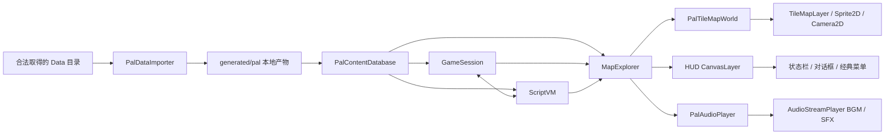
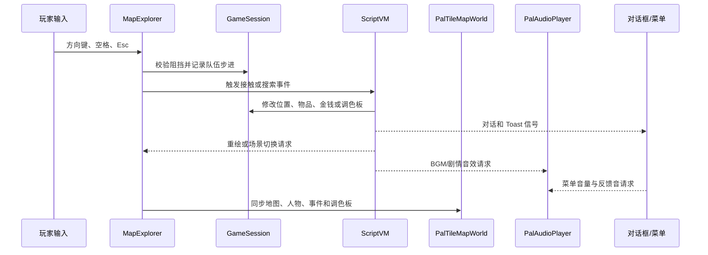

# 整体架构与数据流

项目将“原版静态内容”和“本次游戏的可变状态”严格分开。原版数据先离线转换，本次运行只通过内容数据库读取；脚本虚拟机修改 `GameSession` 和当前事件对象，渲染层只把这些状态显示出来。

## 状态所有权

| 模块 | 持有什么 | 不负责什么 |
| --- | --- | --- |
| `PalDataImporter` | 一次导入的校验结果和生成路径 | 游戏运行、存档、剧情状态 |
| `PalContentDatabase` | 场景、脚本、事件、物品、角色定义和资源缓存 | 玩家当前金钱、位置、背包 |
| `GameSession` | 当前场景、队伍、位置、轨迹、背包、金钱、调色板 | 解码原版文件、绘制 UI |
| `ScriptVM` | 当前指令入口、等待原因、自动脚本调度 | 持久化内容、直接绘制画面 |
| `MapExplorer` | 输入与各模块的编排、当前场景事件引用 | 重新解释资源格式 |
| `PalTileMapWorld` | 地图节点、相机、人物节点、调色板材质和遮挡 | 决定事件是否触发、修改剧情 |
| `PalAudioPlayer` | 当前 BGM、音效声道、循环淡入淡出和即时音量 | 决定场景曲目编号、保存剧情进度 |
| UI | 对话、Toast、菜单和资源实验室的显示状态 | 绕过 ScriptVM 修改剧情 |

## 启动与场景加载

1. Godot 从 `scenes/main.tscn` 启动资源实验室。
2. 用户选择本机数据目录后，`PalDataImporter` 只读原始文件并写入被忽略的 `generated/pal/`。
3. 进入探索场景时，`PalContentDatabase.load_generated()` 读取结构化内容。
4. `GameSession.reset_new_game()` 创建本次临时游戏状态。
5. `MapExplorer` 根据 `scene_index` 取得 `map_number`、场景事件和进入脚本。
6. `PalTileMapWorld` 实例化该 `map_number` 对应的 TileMap 场景；多个剧情场景可以复用同一地图资源。
7. `ScriptVM` 执行场景进入脚本，并通过信号请求重绘、对话、人物动作或场景切换。

`PalTileMapWorld.load_map()` 在场景载入时实例化生成的 PackedScene；`sync_world()` 在位置、事件帧或调色板变化时更新相机和动态 Sprite。`MapExplorer` 默认走该路径，命令行用户参数 `--pal-map-backend=legacy` 可临时启用 CPU 基准。

`Camera2D` 只负责移动地图、人物与事件所在的世界画布。顶部状态栏、对话框、Toast 和经典菜单统一挂在前景 `HudLayer: CanvasLayer`，因此不会随队伍相机平移，也不会被地图节点遮挡。

## 输入、事件与重绘

移动和脚本仍使用 PAL 世界像素坐标。TileMapLayer 只是这些数据的 Godot 原生显示投影，不替代 `.map`、场景定义或 ScriptVM 行为基准。

## 调色板与像素输出

地图和人物纹理保存“颜色索引 + 透明度”，`indexed_palette.gdshader` 在 GPU 上映射到当前 PAL 调色板。这样日夜切换和后续淡入淡出只更新材质，不需要每次移动都重新生成 320×200 RGBA 图片。

CPU 的 `PalMapRenderer` 和 `PalSceneRenderer` 继续作为像素参考。TileMapLayer 已成为默认路径；CPU 路径保留一个里程碑用于排错和本地截图对照。
